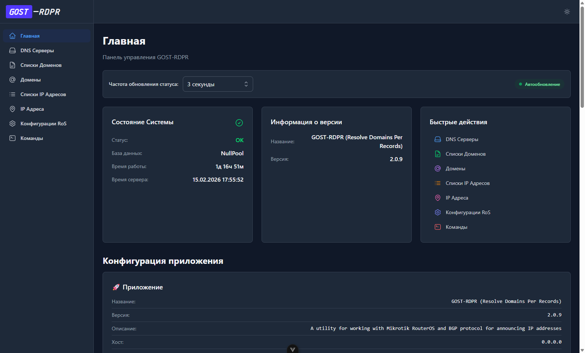
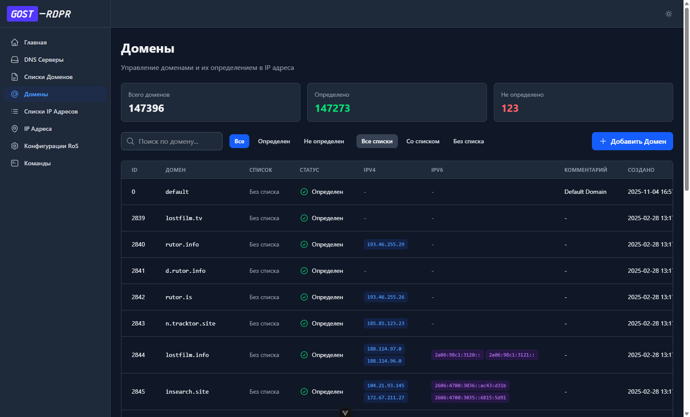

# GOST RDPR (Resolve Domains Per Record)

REPO - <https://github.com/GregoryGost/gost-rdpr>
Docker HUB - <https://hub.docker.com/r/gregorygost/gost-rdpr>

- `latest` tag
- `dev` tag
- `x.x.x` version tag

A utility for working with Mikrotik RouterOS and BGP protocol for announcing IP addresses.

The utility provides parsing of domain names into IP addresses, processing of domain lists and their subsequent parsing,
processing of individual IP addresses and summarized IP groups. Updates firewall address list and routing table.

Docker support OS/ARCH:

- linux/amd64
- linux/arm64

## UI Dashboard

An interface has been developed for the program. Its source code is located in a separate repository.
It can be embedded in a Docker container and is accessible along with the API methods and OpenAPI documentation.

UI REPO - <https://github.com/GregoryGost/gost-rdpr-ui>

<table>
  <tr>
    <td width="50%">
      
      <p align="center"><i>Home page example</i></p>
    </td>
    <td width="50%">
      
      <p align="center"><i>Domains Page example</i></p>
    </td>
  </tr>
</table>

## Application URLs

- `/docs` Swagger/OpenAPI docs
- `/docs/openapi.json` Swagger/OpenAPI json file for export->import to external OpenApi viewer
- `/metrics` - Prometheus metrics

## Environment variables

Available environment variables

| ENV PARAMETER | Type | Default value | Description |
| --------------- | ------ | --------------- | ------------- |
| `ROOT_PATH` | str | `normpath(getcwd())` | Path to the application root folder |
| `ROOT_LOG_LEVEL` | str | `error` | Root level logging |
| `APP_TITLE` | str | `GOST-RDPR (Resolve Domains Per Records)` | Application name |
| `APP_SUMMARY` | str | `A utility for working with Mikrotik RouterOS and BGP protocol for announcing IP addresses` | Description title |
| `APP_DESCRIPTION` | str | `The utility provides parsing of domain names into IP addresses, processing of domain lists and their subsequent parsing, processing of individual IP addresses and summarized IP groups. Updates firewall address list and routing table` | Detailed description of the application |
| `APP_DEBUG` | str | `False` | FastAPI application debug level |
| `APP_VERSION` | str | `2.0.0` | Application version. Get in config from `pyproject.toml` file |
| `APP_HOST` | str | `0.0.0.0` | Listen on IP addr. `0.0.0.0` - Listen on all IP addresses |
| `APP_PORT` | int | `4000` | Listen on TCP/IP specific port |
| `APP_LOG_LEVEL` | str | `error` | Application level logging |
| `QUEUE_MAX_SIZE` | int | `1000` | Maximum size of each individual queue |
| `QUEUE_GET_TIMEOUT` | float | `0.1` | Maximum waiting time for a queue entry. 0.1s = 100ms |
| `QUEUE_SLEEP_TIMEOUT` | float | `0.01` | The maximum wait time while the queue is empty. At the same time, the infinite loop should allow the scheduler to integrate other tasks into the overall flow. 0.01s = 10ms |
| `RESOLVE_DOMAINS_LOG_EVERY` | int | `10` | Specifies the number of messages that will be logged during domain resolution. Distributes the total volume of domains to resolve among this number |
| `DB_LOG_LEVEL` | str | `error` | SQLAlchemy level logging |
| `DB_TIMEOUT` | float | `30.0` | Maximum time to wait for a database to be freed |
| `DB_BASE_DIR` | str | `db` | A separate folder containing the database. It is also later mounted in a container for downloading to a local PC |
| `DB_FILE_NAME` | str | `rdpr-db.sqlite` | Database file name |
| `DB_TABLE_PREFIX` | str | `rdpr_` | Prefix for database table names |
| `DB_SAVE_BATCH_SIZE` | int | `1000` | The maximum number of all insert, update, and delete events in the database queue. This means we write a maximum of 1000 events to the file at a time (which can be very frequent). But you should also look at the timeout parameter |
| `DB_SAVE_BATCH_TIMEOUT` | float | `0.5` | If we haven't accumulated a batch of the size limited by the parameter "parameter1" within the interval specified here, then we do what's already in the current batch |
| `DB_JOURNAL_MODE` | str | `WAL` | Write-Ahead Logging - better concurrent access |
| `DB_WAL_AUTOCHECKPOINT` | int | `1000` | Initiate a checkpoint approximately every 1000 WAL pages (choose experimentally: if WAL grows too quickly, decrease it; if checkpoints interfere, increase it) |
| `DB_SYNCHRONOUS` | str | `NORMAL` | NORMAL - A good balance of performance and reliability for most VDS applications. `FULL`` provides maximum reliability, but is more expensive in terms of I/O. |
| `DB_BUSY_TIMEOUT` | int | `2000` | This is the timeout (in milliseconds) during which SQLite will retry acquiring a lock instead of immediately failing with a "database is locked" error. Defaults in SQLite to 0 (no wait). |
| `DB_POOL_SIZE` | int | `10` | The number of connections to keep open inside the connection pool |
| `DB_POOL_RECYCLE` | int | `1500` | This setting causes the pool to recycle connections after the given number of seconds has passed |
| `DB_POOL_TIMEOUT` | int | `30` | Number of seconds to wait before giving up on getting a connection from the pool |
| `DB_POOL_SIZE_OVERFLOW` | int | `2` | The number of connections to allow in connection pool `overflow`, that is connections that can be opened above and beyond the `db_pool_size` setting, which defaults to five |
| `ATTEMPTS_LIMIT` | int | `5` | How many times a file must be checked with a negative result before it (and all its child entities) are deleted from the database |
| `REQ_CONNECTION_RETRIES` | int | `3` | Requests will be retried the given number of times in case an `httpx.ConnectError` or an `httpx.ConnectTimeout` occurs, allowing smoother operation under flaky networks |
| `REQ_TIMEOUT_DEFAULT` | float | `20.0` | General timeout for connections parameters `connect`, `read`, `write` or `pool` |
| `REQ_TIMEOUT_CONNECT` | float | `20.0` | Individual timeout for `connect` |
| `REQ_TIMEOUT_READ` | float | `30.0` | Individual timeout for `read` |
| `REQ_MAX_CONNECTIONS` | int | `5` | The maximum number of allowable connections. `None` for no limits |
| `REQ_MAX_KEEPALIVE_CONNECTIONS` | int | `30` | Number of allowable keep-alive connections. `None` to always allow |
| `REQ_SSL_VERIFY` | bool | `True` | When making a request over HTTPS, HTTPX needs to verify the identity of the requested host. To do this, it uses a bundle of SSL certificates (a.k.a. CA bundle) delivered by a trusted certificate authority (CA). You can disable SSL verification completely and allow insecure requests |
| `DOMAINS_FILTERED_MIN_LEN` | int | `3` | The minimum domain length required to save it to the database. This is necessary to filter out empty domains that, for some reason, are generated in MikroTik scripts |
| `DOMAINS_UPDATE_INTERVAL` | int | `172800` | Domain selection period. This means that if a domain has been processed, it will not be processed again until this period has passed. Specified in seconds. 172800s = 2days |
| `DOMAINS_RESOLVE_SEMAPHORE_LIMIT` | int | `60` | Limit of concurrent domain resolving tasks |
| `DOMAINS_BLACK_LIST` | str | `None` | Domains that should not be included in the database. Comma-separated list |
| `LISTS_UPDATE_INTERVAL_SEC` | int | `604800` | The period after which the file must be uploaded and verified again. Specified in seconds. 604800s = 7days |
| `IP_NOT_ALLOWED` | str | `127.0.0.1, 0.0.0.0, 0.0.0.0/0, ::, ::/0` | A list of IP addresses that should not be included in the database. Comma-separated list. |
| `ROS_REST_API_READ_TIMEOUT` | float | `59.0` | ROS REST API server timeout = 60s |

## MikroTik RouterOS

RouterOS v7 only !!! RouterOS v6 NOT supported !!!

- bridge interface has already been created earlier

You need to activate the container functionality through the device-mod. On different virtual servers, reboot may work
as a simple reboot command rather than a hard power-down (which is required to enable the functionality correctly). In
this case, you need to apply the snapshot technique. You need to capture the snapshot and deploy it immediately after
the command is issued and do not exit the RouterOS terminal while doing so.

```shell
# enable container device-mode
/system/device-mode/update container=yes
```

```shell
# setup network interface
/interface/veth/add address=192.168.50.20/24 comment="Container LAN" gateway=192.168.50.1 gateway6="" name=LAN-VEth1
/interface/bridge/port/add bridge=LAN-Bridge interface=LAN-VEth1
# setup containers config
/container/config/set ram-high=256M registry-url=https://registry-1.docker.io tmpdir=container/tmp
# setup environments
/container/envs/
add key=LOG_LEVEL name=rdpr-envs value=info
add key=ROOT_PASS name=rdpr-envs value=123456789
# setup mounts
/container/mounts/add dst=/app/db name=rdpr-db src=/container/gost-rdpr-db
# setup container
/container
add remote-image=gregorygost/gost-rdpr:latest interface=LAN-VEth1 envlist=rdpr-envs hostname=gost-rdpr mounts=rdpr-db \
root-dir=container/gost-rdpr logging=yes comment=GOST-RDPR start-on-boot=yes
```

You need to create a separate group and user for it

```shell
# add API group
/user/group/add name=api policy=read,write,api,rest-api,!local,!telnet,!ssh,!ftp,!reboot,!policy,!test,!winbox,!password,!web,!sniff,!sensitive,!romon
# enable www and api services
/ip/service/
set www address=192.168.50.20/24
set api address=192.168.50.20/24
# create user
/user/add group=api name=rdpr-api-user
```

## Patch notes / Changelog

[CHANGELOG.md](./CHANGELOG.md "Changelog / Patch notes")

## For contrib

Python version >= `3.14`

How to alt install python 3.14 in WSL Debian

```sh
sudo apt update
sudo apt install pkg-config build-essential zlib1g-dev libncurses5-dev libgdbm-dev libnss3-dev libssl-dev libreadline-dev libffi-dev libsqlite3-dev -y
wget https://www.python.org/ftp/python/3.14.0/Python-3.14.0.tgz
tar -xzvf Python-3.14.0.tgz
cd Python-3.14.0
dpkg-architecture --query DEB_BUILD_GNU_TYPE # use in --build next ./configure
./configure --build="x86_64-linux-gnu" --prefix=/usr/local --enable-optimizations --enable-loadable-sqlite-extensions --enable-option-checking=fatal --enable-shared LDFLAGS="-Wl,-rpath /usr/local/lib" --with-ensurepip
nproc # if output 20 CPUS use 18
sudo make -j 18
sudo make altinstall
python3.14 -VV
```

example output

```sh
Python 3.14.0 (main, Nov 27 2025, 23:09:49) [GCC 12.2.0]
```

Create virtual env

```sh
python3.14 -m venv .venv
```

Or Windows

```powershell
& 'C:\Program Files\Python\Python3.14\python.exe' -m venv .venv
```

Activate venv

```powershell
.\.venv\Scripts\activate
```

```shell
source .venv/bin/activate
```

Upgrade pip

```shell
python -m pip install --upgrade pip
```

Install libs from lock poetry file

```shell
poetry install
```

or manual install libs

```sh
pip install poetry
poetry init
```

```shell
poetry add fastapi
poetry add SQLAlchemy
poetry add aiosqlite
poetry add aiosqlitepool
poetry add dnspython
poetry add uvicorn
poetry add httpx
poetry add pydantic-settings
poetry add opentelemetry-exporter-prometheus
poetry add cashews
```

or upgrade libs (not recomend)

```sh
poetry update
poetry update fastapi
```

Get tree all modules

```sh
poetry show --tree
```

### TODO

- ADD NEW JOB - check if IP addresses are included in a wider mask (summarization)

### Build docker images

Build docker image for RouterOS CHR `AMD64(x86_64)` and `ARM64` device

```shell
# first run
docker buildx create --driver=docker-container --name build-container

# all after first run
docker buildx use build-container

# Build for amd64(x86_64) and arm64 without arguments
# PROD
docker buildx build --no-cache --platform linux/amd64,linux/arm64 --push -t gregorygost/gost-rdpr .
# Spec PROD version
docker buildx build --no-cache --platform linux/amd64,linux/arm64 --push -t gregorygost/gost-rdpr:latest -t gregorygost/gost-rdpr:2.0.1 .
# DEV
docker buildx build --no-cache --platform linux/amd64,linux/arm64 --push -t gregorygost/gost-rdpr:dev .
# TEST in builder
docker buildx build --no-cache --progress=plain --platform linux/amd64 --load -t gregorygost/gost-rdpr:dev --builder=build-container .
```

```shell
# run docker after build
docker run --name gost-rdpr -p 8080:80 -p 5000:4000 -e LOG_LEVEL='debug' --memory=1024m --cpus="1" --restart unless-stopped -d gregorygost/gost-rdpr
# simple
docker run --name gost-rdpr-dev -p 8080:80 -p 5000:4000 -d gregorygost/gost-rdpr:dev
# enter in docker shell
docker exec -it gost-rdpr-dev bash
```

## Docs

- [Asyncio FIFO Queue in Python](https://habr.com/ru/articles/764932/)

## Licensing

All source materials for the project are distributed under the [GPL v3](./LICENSE "License Description") license. You
can use the project in any form, including for commercial activities, but it is worth remembering that the author of the
project does not provide any guarantees for the performance of the executable files, and also does not bear any
responsibility for claims or damage caused.

This application uses external modules. The authors of these modules are (or are not) responsible for the quality and
stability of their work. See the licenses of these modules. External modules are listed in the dependencies file of the
`pyproject.toml`.

## About

GregoryGost - <https://gregory-gost.ru>
